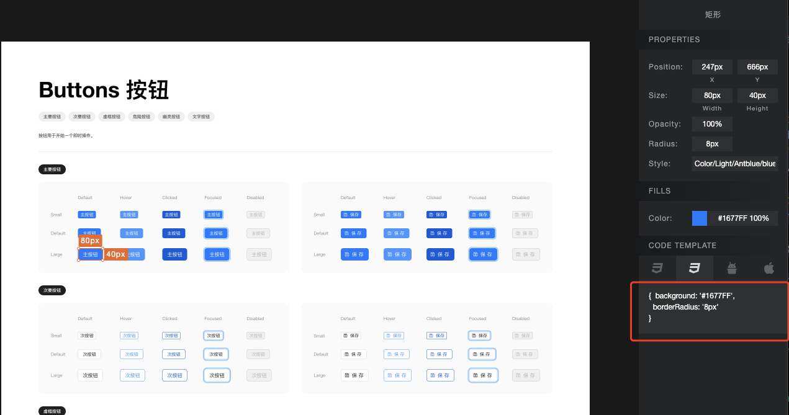

# 准备工作

1、删除package-lock.json文件

2、Node 版本(注意，使用这个版本的node安装依赖的时候才不会报错)

```
nvm use 16.14.2

node -v   
v16.14.2
```

3、npm 安装源设置(npm 安装源使用 npm),一定要使用下面这种方式安装依赖，否则会报错
npm install --ignore-scripts

## 插件打包
```
npm run start 
npm run build
```

## sketch 插件安装
插件-管理插件-显示插件文件夹，把 sketch-meaxure.sketchplugin 文件粘贴到插件文件夹中。

## 改动点
- CODE TEMPLATE 新增 React 样式模板，修改文件路径 (ui/render/inspector/codeTemplate.ts)
